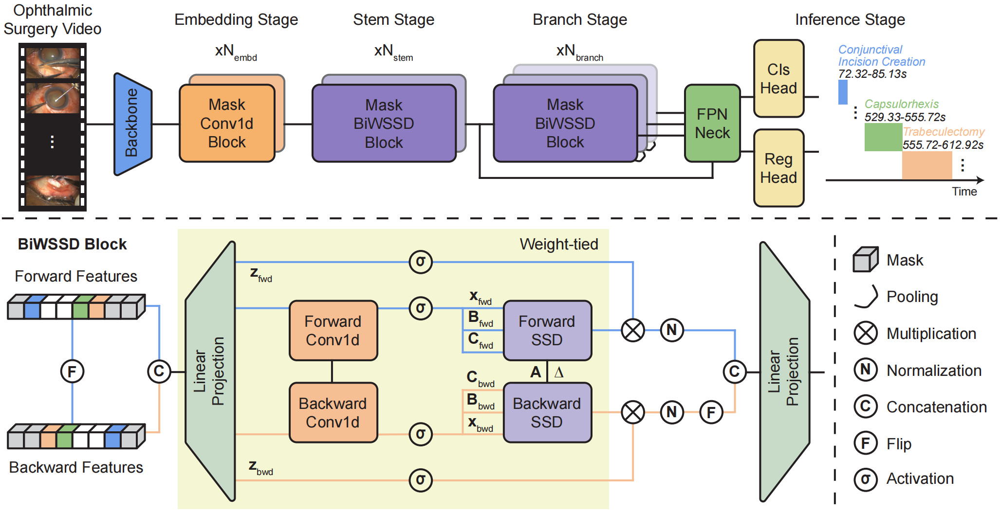

# OphBiWSSD

Official implementation of **OphBiWSSD**, a *state-of-the-art* framework for ophthalmic surgical video understanding on the [OphNet](https://github.com/minghu0830/OphNet-benchmark) benchmark.

## Overview

OphBiWSSD is a Mamba-based framework that reformulates surgical temporal action localization leveraging **Bidirectional Weight-tied State Space Duality**. The proposed model adeptly captures anti-causal surgical dependencies without quadratic memory overhead and enforces direction-invariant feature learning across both forward and backward scanning paths.



## Granularities

OphBiWSSD supports two granularities of annotation from [OphNet](https://github.com/minghu0830/OphNet-benchmark):

| Task | Classes | Config prefix |
|:-:|:-:|:-:|
| Operation detection | 107 | `medical_*_operation` |
| Phase recognition | 52 | `medical_*_phase` |

Four pre-extracted feature types are supported as input: **CSN**, **SlowFast**, **SwinViViT**, and **VideoMAE**.

## Main Results

See [assets/results.md](assets/results.md) for full benchmark tables across all features and tasks.

The performance of OphBiWSSD consistently outperforms five top-tier TAL benchmarks under four video features ([CSN](https://arxiv.org/abs/1904.02811), [SlowFast](https://github.com/facebookresearch/SlowFast), [SwinViViT](https://github.com/SwinTransformer/Video-Swin-Transformer), [VideoMAE](https://github.com/OpenGVLab/VideoMAEv2)): [ActionFormer](https://github.com/happyharrycn/actionformer_release) (ECCV 2022), [TriDet](https://github.com/dingfengshi/tridet) (CVPR 2023), [DyFADet](https://github.com/yangle15/DyFADet-pytorch) (ECCV 2024), [CLTDR-GMG](https://github.com/LiQiang0307/CLTDR-GMG) (AAAI 2025), [ActionMamba](https://github.com/OpenGVLab/video-mamba-suite) (IJCV 2026). mAP (%) is reported at tIoU thresholds α ∈ {0.3, 0.4, 0.5, 0.6, 0.7}. † uses the same detection head and loss as CLTDR-GMG. **Bold**: best result. <u>Underline</u>: second best result.

### Temporal Phase Localization (52 classes)

|         Model         |     0.3      |     0.4      |     0.5      |     0.6      |     0.7      |     Avg.     |
| :-------------------: | :----------: | :----------: | :----------: | :----------: | :----------: | :----------: |
|     ActionFormer      |    46.49     |    43.61     |    38.62     |    33.33     |    26.04     |    37.62     |
|        TriDet         |    46.70     |    44.23     |    41.33     |    35.22     |    28.61     |    39.22     |
|        DyFADet        |    47.82     |    45.30     |    39.74     |    34.24     |    28.58     |    39.14     |
|       CLTDR-GMG       |    50.24     |    47.39     |    43.18     |    37.82     |    31.41     |    42.01     |
|      ActionMamba      |    49.53     |    47.37     |    42.65     |    35.77     |    27.32     |    40.53     |
| **OphBiWSSD (Ours)**  | <u>52.98</u> | <u>50.19</u> | <u>45.76</u> | <u>39.97</u> | <u>33.18</u> | <u>44.42</u> |
| **OphBiWSSD† (Ours)** |  **54.76**   |  **51.55**   |  **46.41**   |  **41.32**   |  **34.96**   |  **45.80**   |

### Temporal Operation Localization (107 classes)

|         Model         |     0.3      |     0.4      |     0.5      |     0.6      |     0.7      |     Avg.     |
| :-------------------: | :----------: | :----------: | :----------: | :----------: | :----------: | :----------: |
|     ActionFormer      |    45.44     |    42.68     |    37.92     |    31.46     |    24.61     |    36.42     |
|        TriDet         |    48.45     |    46.02     |    41.36     |    35.82     |    29.69     |    40.27     |
|        DyFADet        |    46.20     |    43.98     |    40.12     |    33.86     |    27.48     |    38.33     |
|       CLTDR-GMG       |    48.95     |    45.51     |    41.19     |    36.67     |    29.68     |    40.40     |
|      ActionMamba      |    49.18     |    46.34     |    42.05     |    34.71     |    26.87     |    39.83     |
| **OphBiWSSD (Ours)**  | <u>52.59</u> | <u>49.22</u> | <u>45.13</u> | <u>37.83</u> | <u>30.62</u> | <u>43.08</u> |
| **OphBiWSSD† (Ours)** |  **52.60**   |  **49.83**   |  **46.35**   |  **39.80**   |  **33.46**   |  **44.41**   |

## Requirements

- Python 3.10+
- PyTorch with CUDA (recommend 2.7.1+cu118)
- [Mamba](https://github.com/state-spaces/mamba) and [causal-conv1d](https://github.com/Dao-AILab/causal-conv1d) (source included under `mamba_utils/`)

Install Python dependencies:

```bash
pip install torch torchvision einops wandb pyyaml h5py
```

Build the 1D NMS CPU extension:

```bash
cd libs/utils
pip install -e .
```

Build the Mamba CUDA extensions:

```bash
cd mamba_utils/causal-conv1d
pip install -e .

cd ../mamba
pip install -e .
```

## Data Preparation

Download the OphNet2024 annotations and pre-extracted features and place them as follows:

```
dataset/
├── tal_annotations/
│   ├── OphNet2024_operation.json
│   └── OphNet2024_phase.json
└── features/
    ├── csn/
    ├── slowfast/
    ├── swinvivit/
    └── videomae/
```

Update the `json_file` and `feat_folder` paths in the config files under `configs/` if your dataset is located elsewhere.

## Project Structure

```
OphBiWSSD/
├── configs/              # Training configs (feature × task combinations)
├── libs/
│   ├── core/             # Config loading
│   ├── datasets/         # Dataset loaders (OphNet2024 + public benchmarks)
│   ├── modeling/         # Backbone, neck, head, loss
│   └── utils/            # Training utilities, metrics, NMS
├── mamba_utils/
│   ├── mamba/            # Mamba source with BiWSSD module
│   └── causal-conv1d/    # Causal conv1d CUDA kernel
├── train.py
└── eval.py
```

## Training

```bash
python train.py --config configs/medical_csn_operation.yaml
```

Replace the config file to switch feature type or task:

```bash
# Phase recognition with VideoMAE features
python train.py --config configs/medical_videomae_phase.yaml

# Resume from a checkpoint
python train.py --config configs/medical_csn_operation.yaml --resume ckpt/<checkpoint>.pth.tar
```

## Evaluation

```bash
python eval.py --config configs/medical_csn_operation.yaml --ckpt ckpt/<checkpoint>.pth.tar
```

## Acknowledgement

We appreciate the open source of [OphNet](https://github.com/minghu0830/OphNet-benchmark), [ActionFormer](https://github.com/happyharrycn/actionformer_release), [TriDet](https://github.com/dingfengshi/tridet), [DyFADet](https://github.com/yangle15/DyFADet-pytorch), [CLTDR-GMG](https://github.com/LiQiang0307/CLTDR-GMG), [ActionMamba](https://github.com/OpenGVLab/video-mamba-suite), [mamba](https://github.com/state-spaces/mamba), [VideoMAE](https://github.com/OpenGVLab/VideoMAEv2).
